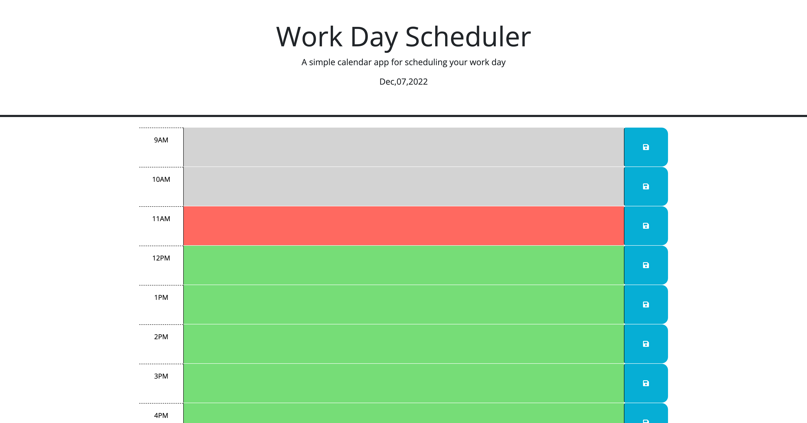

# Work Day Scheduler
JavaScript Scheduler

## Table of contents
* [General info](#general-info)
* [Website](#webpage-URL)
* [Screenshots](#screenshots)
* [Code](#Code)

## General info
A JavaScript hourly schedule for current day that allows the user to enter their plans for each hour of the day.

## Website
[JavaScript Work Day Scheduler](https://anomic84.github.io/Challenge-5-Work-Day-Scheduler
/)

## Screenshots

## Code 
* HTML
* CSS
* JavaScript
